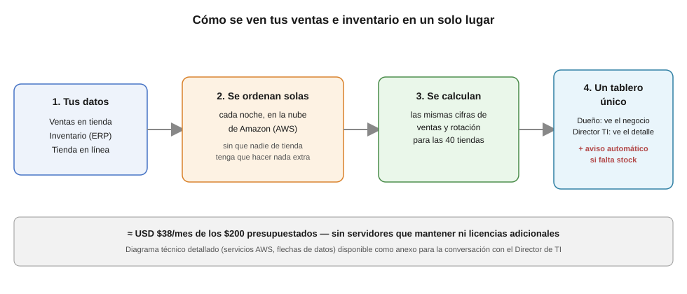

# Propuesta técnica — Plataforma de datos CaféNorte

**Para:** Dirección general y Dirección de TI, CaféNorte
**De:** Tuxpas (AWS Advanced Partner)
**Sobre:** Arquitectura de producción para consolidar ventas e inventario de las 40 tiendas + Shopify en un solo lugar

## El problema en una frase

Hoy los números de ventas e inventario viven en 3 sistemas que no se hablan entre sí; cada área reporta una cifra distinta porque nadie está reconciliando POS, ERP y Shopify de la misma forma. Ya construimos y validamos esa lógica de reconciliación (ver repositorio) — esta propuesta es cómo llevarla a producción en AWS, dentro de tu presupuesto de USD $200/mes.

## Arquitectura propuesta

*Diagrama técnico detallado (servicios AWS específicos, flujo de datos) en [`docs/arquitectura_aws.svg`](docs/arquitectura_aws.svg)

**Por qué esta arquitectura y no otra:**

- **Serverless de punta a punta** (Lambda, Athena, S3): no hay servidores que mantener encendidos ni parchar — con 40 tiendas y ~330k registros/6 meses el volumen no justifica un clúster permanente (Redshift, EMR), y esos servicios por sí solos ya rebasarían el presupuesto.
- **Mismo modelo SQL validado localmente**: el pipeline que entregamos (DuckDB + SQL) corre sin cambios de lógica dentro de una Lambda — no se reescribe nada para producción, solo se reprograma para correr contra S3 en vez del disco local. Menor riesgo, menor tiempo de puesta en marcha.
- **Un solo lugar para ver los números**: Amazon QuickSight conecta directo a Athena y le da al dueño una vista ejecutiva sin tocar SQL, mientras el Director de TI puede auditar el dato crudo cuando lo necesite.
- **Alertas proactivas de negocio**: SNS avisa por correo cuando una tienda lleva más de 3 días en quiebre de stock (la misma métrica de la Pregunta 2) — no hay que entrar al dashboard para enterarse.

## Estimación de costo mensual

Cálculo propio (no se generó vía AWS Pricing Calculator por restricciones de este entorno), con supuestos explícitos abajo.

| Servicio | Uso estimado | Costo/mes (USD) |
|---|---|---|
| Amazon S3 (raw + curada) | ~5 GB acumulados, requests diarias | $2 |
| AWS Lambda (ETL diario) | 1 corrida/día, ~5 min, 1 GB RAM | $3 |
| Amazon EventBridge | 1 regla programada | $0 (free tier) |
| AWS Glue Data Catalog | <100k objetos catalogados | $0 (free tier) |
| Amazon Athena | ~60 consultas/mes, <1 GB escaneada c/u | $1 |
| Amazon QuickSight | 1 Author (dueño) + 1 lector (Director TI) | $24 + $5 |
| Amazon SNS | alertas de quiebre, bajo volumen | $1 |
| AWS Secrets Manager | 1 secreto (credenciales Shopify) | $0.40 |
| Amazon CloudWatch | logs + 2-3 alarmas | $2 |
| **Total estimado** | | **≈ $38 USD/mes** |

**Supuestos del cálculo:** región `us-east-1`; 1 corrida diaria del pipeline (no tiempo real); volumen de datos crece de forma similar a los últimos 6 meses; 2 usuarios de QuickSight. Con **$38 de $200 de presupuesto usados (~19%)**, queda margen amplio para: 2-3x más tiendas, más frecuencia de refresco, o agregar Redshift Serverless más adelante si el volumen crece de forma importante — sin renegociar presupuesto. Antes de firmar, se puede formalizar este número con una corrida real en el AWS Pricing Calculator.

## Plan de implementación por fases

**Fase 1 — Fundamentos (semanas 1-2).** S3 + Lambda + Glue + Athena. Se replica exactamente el pipeline ya validado, corriendo diariamente contra las 3 fuentes. Entregable: las 4 respuestas de negocio disponibles vía SQL en Athena, sin interfaz visual todavía.

**Fase 2 — Consumo (semana 3).** Dashboard de QuickSight para el dueño (ventas y rotación, las 40 tiendas en un lugar) + alertas SNS de quiebre de stock. Entregable: la promesa original del cliente, cumplida.

**Fase 3 — Robustez (semana 4 en adelante).** Alarmas de CloudWatch si el ETL falla, pruebas automatizadas en CI (las mismas del repo, corriendo en cada cambio), y una segunda iteración para cerrar los huecos de mapeo de SKU documentados en el README (requiere participación de POS/ERP del lado de CaféNorte, no es solo trabajo de datos).

**Riesgos identificados:**
- La ingesta sigue dependiendo de exports manuales de POS/ERP (no hay integración directa a esos sistemas legacy) — si una tienda no exporta, ese día queda incompleto. Mitigable con una alarma de "fuente no llegó" en Fase 3.
- Los huecos de mapeo de SKU (ver README, ~16 productos sin costo conocido) no se resuelven con más ingeniería de datos — requieren que CaféNorte corrija su maestro de productos en el ERP/POS.
- Si el negocio crece más rápido de lo esperado (más tiendas, ventas en tiempo real), Athena/S3 deja de ser suficiente y habría que migrar a Redshift Serverless — cambio de arquitectura, no solo de configuración, y con otro rango de costo.

## Supuestos y preguntas abiertas antes de firmar

1. ¿Los SKUs huérfanos de POS/Shopify corresponden a los 10 SKUs huérfanos del ERP con numeración casi idéntica? Es especialmente probable en 4 casos donde ya existe un registro de mapeo POS↔Shopify al que solo le falta el campo de ERP (ver README, sección de supuestos, punto 3). Esto lo debe confirmar alguien con acceso al ERP — no se puede inferir solo de los datos.
2. ¿La actualización diaria es suficiente, o hay una necesidad real de ver quiebres de stock en tiempo real?
3. ¿CaféNorte ya tiene una app/integración con permisos sobre la API de Shopify, o Tuxpas necesita gestionar esa conexión desde cero?
4. ¿El presupuesto de $200/mes es exclusivamente para esta infraestructura de datos, o debe compartirse con otras cargas ya existentes en la cuenta de AWS?
